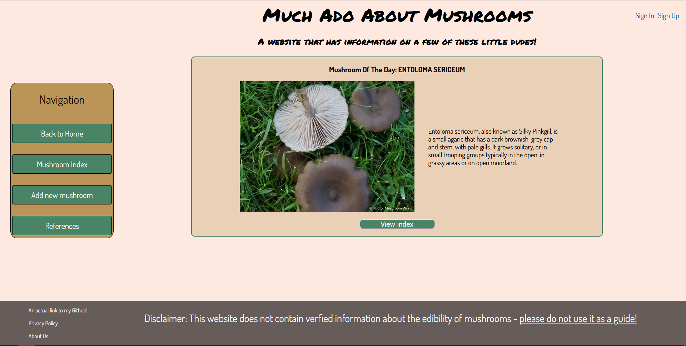

<h1>ABOUT THE APP</h1>

<h2>TITLE</h2>
MUCH ADO ABOUT MUSHROOMS

<h2>WHAT IS IT?<h2>
It's a place that displays some very basic information on mushrooms. No details like spore prints or stem rings (yet!) 

<h3>TECHNOLOGIES USED</h3>
Javascript, EJS, MongoDB and your basic HTML & CSS.

<h3>ATTRIBUTIONS</h3>
All, and I do mean <i>all</i>, of the details of the mushrooms - right from the names down to the images - were taken from <a href="https://www.mushroom.world/">Mushroom World</a>. The <i>edibility</i> attribute for the mushrooms is randomised and is not true to life. As a disclaimer once again, please do not eat wild mushrooms unless you are a trained and very confident mycologist, and <i>especially</i> not on advice from my website.

<h3>NEXT STEPS</h3>
I want to include multiple other functions and data models, not least of which is the aforementioned additional details on gill type or typical habitats. The ones I have planned for later are:
<ol>
<li>An alphabetised index list, for easier navigation.</li>
<li>A comments section on the show page for each mushroom, so that users have a space to hold discussions about them.</li>
<li>A user profile page, so that users can view the comments they've left on various show pages, or mushrooms they've "favourited".</li>
<li>A <i>Mushrooms in Media</i> section, so that the app owner has a space to talk about the various really cool mushrooms they've come across in various mediums. For example, the app owner would love to spend a solid ten minutes talking about the gigantic mushroom towers found in <i>Morrowind's</i> Telvanni-governed districts (they develop their own ecology!)</li>
<li>A recipe section for mushrooms that are (a) safely edible, and (b) do not have dangerous side effect if improperly prepared.</li>
</ol>

